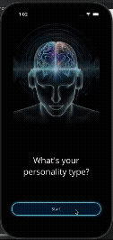

# Personality Quiz Lab

## Description

This is a simple Maui application meant as the base for three Mobile Applications Development course labs.  It is a true or false based personality quiz and the individual lab versions (B, C, D) can be found via checking out the appropriate branches.

## Demo

## Coverage:
 * Module 3 Lab B
 * Module 3 Lab C
 * Module 3 Lab D

### Module 3 Lab B (branch: [module-3-lab-b](https://github.com/thinksideways/personality-quiz-app/tree/module-3-lab-b))

`Create a True/False Quiz App.  This has one page with a Label for the question and two Buttons: True and False.  After five questions, the Buttons should cease to be displayed and results should be displayed in the question label.

Make this app look as professional as possible.

Up to 5 points extra credit for a Personality Quiz.`

### Module 3 Lab C (branch: [module-3-lab-c](https://github.com/thinksideways/personality-quiz-app/tree/module-3-lab-c))

`Rewrite the Quiz App.  The new app should include images and replace the buttons with left and right-swiping.  Right is true and left is false.

30 Points for a working app that has a label the changes as you swipe to the bright and an image.

50 Points if the image also changes with the swipe.`

### Module 3 Lab D (branch: [module-3-lab-d](https://github.com/thinksideways/personality-quiz-app/tree/module-3-lab-d))

`Rewrite the Quiz App.  The new app should utilize a list and can either have buttons or swiping for each question.`

### Image Credits

[free stock image from pixabay](https://pixabay.com/illustrations/ai-generated-listening-music-9014105/) with hand editing done in GIMP to distinguish an introvert vs extrovert.

